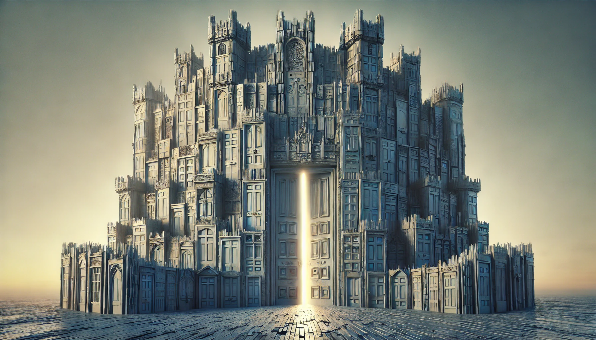

# fortressofdoors
i recently rediscovered a blog that had come about way back when i was getting into the economic philosophy of georgism

i was sad to hear that his son had passed away

https://www.fortressofdoors.com/will-capital-havers-or-capability-havers-gain-the-most-from-ai/

the punchline of the post is that "in a magic genie contest, the winner of the contest is the person that asks better questions"

so naturally since it was even suggested in the post to ask the genie what question you should ask, i asked gpt4 about the post itself and given the premise, what questions should we ask:

This is a fascinating premise with significant implications for the future of value creation, competition, and economic dynamics in a world transformed by AI. To refine your hypothesis and challenge your assumptions, here are some critical questions you should ask:

### Questions about Distribution of Value:
1. **How does the accessibility of genies (AI) impact the existing wealth distribution?**
   - Will access truly remain universal and cheap, or will gatekeeping mechanisms arise (e.g., subscription fees, proprietary systems)?

2. **What happens to existing capital structures when labor becomes commoditized?**
   - Will traditional capital assets (land, infrastructure) gain disproportionate value, or will they diminish in significance compared to knowledge and strategic insight?

3. **Does the ease of acquiring "genie labor" reduce or exacerbate inequality?**
   - Could those who already have capital use it to create proprietary enhancements or synergistic advantages that others cannot match?

4. **What does "perfectly obedient and benevolent" really mean in practice?**
   - Is there a scenario where capital-havers manipulate or distort this benevolence to maintain control over outcomes?

---

### Questions about Capability and Competitive Advantage:
5. **What differentiates good questions from great ones?**
   - Are great questions a function of innate creativity, deep domain expertise, or access to better meta-information (e.g., understanding cultural shifts or customer desires)?

6. **Will the "capability-havers" form a new elite?**
   - Does asking better questions become a skill that concentrates among a small group, effectively replacing the current capital-owning class with a new intellectual elite?

7. **How can people learn to ask better questions in a genie-driven world?**
   - If genies help refine questions, does that democratize capability further, or does it create a self-reinforcing loop where those already good at questioning become even better?

8. **What secondary skills become valuable in this context?**
   - Does the ability to synthesize insights, predict trends, or build coalitions become the new differentiator?

---

### Questions about Market Dynamics:
9. **What replaces traditional barriers to entry?**
   - If genies equalize talent and production, do other forms of scarcity—such as attention, branding, or unique customer insights—become the primary battleground?

10. **How do network effects evolve in a genie world?**
    - Do platforms like Amazon or Google persist because they aggregate demand and streamline discovery, or do they falter as individuals gain more direct power to compete?

11. **What prevents market saturation?**
    - With everyone leveraging genies, how do markets avoid collapsing into infinite competition and a race to the bottom?

12. **Does intellectual property still hold value?**
    - How does the genie economy affect patents, copyrights, and other forms of traditional IP when replication becomes trivial?

---

### Questions about Strategic Behavior:
13. **How do incumbents adapt to a genie economy?**
    - Do large companies pivot to leverage genies more efficiently, or do they fall victim to their own inertia?

14. **What role does storytelling or branding play?**
    - As products and services become easier to create, does differentiation increasingly rely on narrative, emotional resonance, or aesthetics?

15. **Can genies create "moats"?**
    - Is there a way to use genies to maintain sustainable competitive advantages, or do they inherently level the playing field?

---

### Broader Questions:
16. **What ethical considerations arise in a genie-driven world?**
    - How do societies ensure that genie access remains equitable and doesn't lead to new forms of exploitation or surveillance?

17. **How does human purpose evolve?**
    - If genies handle all labor and intellectual challenges, how do individuals find meaning and fulfillment in such a world?

18. **What prevents stagnation?**
    - If genies provide answers to everything, do humans stop pushing boundaries, or do we shift to more philosophical, artistic, or exploratory pursuits?

19. **What happens to collective decision-making?**
    - When everyone has access to perfect information, does governance become more efficient, or do disagreements intensify due to differing values and priorities?

20. **What are the long-term cultural impacts of ubiquitous genie access?**
    - Does this lead to a flourishing of creativity and innovation, or a homogenization of thought and output?

---

Exploring these questions can sharpen your argument, reveal hidden dynamics, and uncover nuanced insights about the interplay of capital, capability, and competition in a post-genie world.

also the title of the blog post got me thinking to ask the genie another question
... what exactly is a fortress made of doors? seems like a cool but ambiguous analogy

Here are 10 possible analogies for a fortress made of doors:

1. **Opportunities and Choices**: The fortress represents the vast array of opportunities and decisions in life, each door symbolizing a different path or possibility.

2. **Barriers to Understanding**: A fortress of doors could symbolize the layers of complexity or obstacles that one must open and overcome to achieve understanding or knowledge.

3. **Secrets and Mysteries**: The fortress could represent hidden truths, with each door leading to a concealed secret or mystery to be unraveled.

4. **Emotional Defense Mechanisms**: The fortress might symbolize the walls people build to protect their emotions, with each door representing a selective way to let others in.

5. **The Complexity of Identity**: Each door could represent a facet of one's personality, experiences, or roles, forming the complex structure of a person’s identity.

6. **The Bureaucracy of Systems**: A fortress of doors might symbolize the intricate and often frustrating processes of bureaucratic systems, where every door represents a new step or requirement.

7. **The Illusion of Freedom**: The fortress could symbolize a false sense of freedom or accessibility, where numerous doors appear to offer choices, but many lead nowhere or back to the same place.

8. **The Human Mind**: The fortress could serve as an analogy for the human mind, with its countless compartments, memories, and locked-away thoughts, waiting to be explored or unlocked.

9. **Cultural or Social Norms**: It could represent the constraints and permissions within a society, where each door symbolizes a rule, tradition, or expectation one must navigate.

10. **The Journey of Self-Discovery**: The fortress might symbolize the path of exploring oneself, where every door leads to a new layer of self-awareness, challenges, or revelations.

and it was able to come up with some other analogies in a similar vein that are kind of cool (after some tries)

A Bridge to Nowhere: Stretching endlessly over an abyss, with no visible destination but the promise of something just out of reach.

An Ocean of Unspoken Words: Depths filled with the weight of thoughts never expressed, where silence echoes louder than any sound, symbolizing the immense void of what is left unsaid.

A Mirror That Sees You First: A reflection that forms before you stand before it, suggesting identity shaped by external forces or a reality independent of perception.

A Spiral Without a Center: An endless curve that turns inward forever, yet reveals no core, representing the search for meaning in an existence that defies resolution.

A Seed That Grows Roots in the Sky: Life flourishing in an impossible direction, challenging the limits of imagination and redefining what is possible.

A Fire That Consumes Its Own Ashes: A cycle of destruction and renewal so complete that even the remnants fuel its existence, a metaphor for transformation born from obliteration.

A Path Worn Into the Wind: A journey marked in a medium that leaves no trace, representing transient actions or ephemeral legacies in an impermanent world.

A Question That Answers Itself: An inquiry so profound that the act of asking reveals its resolution, reflecting the unity of doubt and truth.

A Void That Remembers: An emptiness that retains the imprint of what it once held, suggesting that absence itself can carry the weight of presence and memory.

